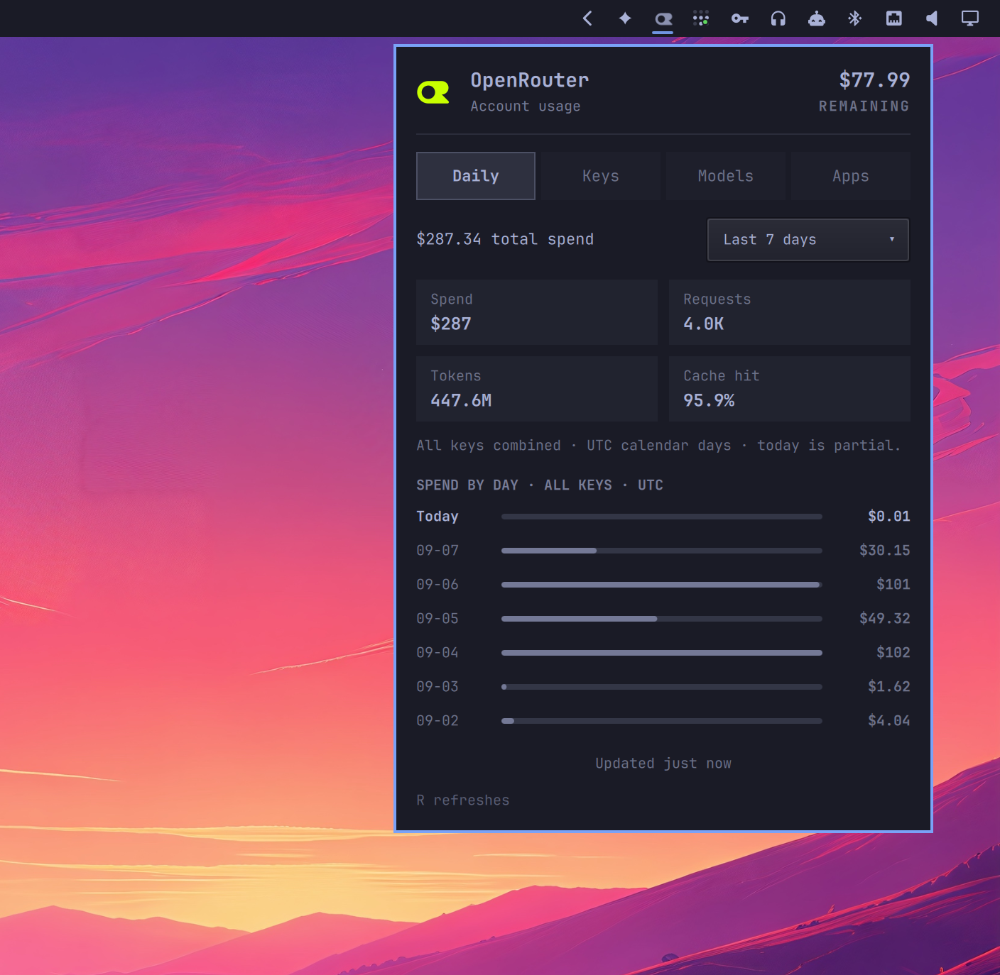

# OpenRouter Plus Improved for Omarchy

OpenRouter account balance and daily usage across all API keys, including usage from other machines and apps. Requires one [management API key](https://openrouter.ai/settings/management-keys). Inference keys are not used.

The taskbar and panel header show the live remaining balance without crowding the bar. Balances below `$1,000` keep their cents, four- and five-figure balances use one decimal such as `$12.3k`, and six-figure balances drop the smaller digits, such as `$150k`. Hover over the taskbar widget for the exact amount.



This is a modification of [calmasacow/omarchy-openrouter-usage-plus](https://github.com/calmasacow/omarchy-openrouter-usage-plus), derived from [sepehr500/omarchy-openrouter-usage](https://github.com/sepehr500/omarchy-openrouter-usage).

## Install

Requires Omarchy 4.x and Python 3.

```bash
omarchy plugin add https://github.com/digitalbase/omarchy-openrouter-plus-improved.git --enable
```

Edit `~/.config/omarchy/agents/openrouter.json` to contain your management key:

```json
{
  "managementKey": "sk-or-v1-REPLACE_WITH_YOUR_MANAGEMENT_KEY"
}
```

Protect the config file:

```bash
chmod 600 ~/.config/omarchy/agents/openrouter.json
```

Alternatively, set `OPENROUTER_MANAGEMENT_KEY` in the shell's environment. This takes precedence over the file. The old `apiKey` setting and `OPENROUTER_API_KEY` are ignored. No inference key or local pi/omp session files are needed. Keep live keys out of Git.

## Daily usage

The panel lists spend per UTC calendar day with all keys combined. Hover over a day for token and request counts. Today is partial and reflects the data currently available from OpenRouter.

The panel has four tabs: Daily, Keys, Models, and Apps. Daily shows the spend-by-day chart. Every tab shows spend, requests, tokens, and cache hit rate directly below the period filter. The other tabs list spend per key, model, or app, highest spend first. Hover over an entry for its full name and token count. Only entries with recorded activity appear.

All tabs share one dropdown for the last 4, 8, or 24 hours or the last 3, 7, 30, or 90 UTC calendar days, including today. The hourly options are rolling windows grouped by UTC date, so they may show two partial days. The default is seven days. Changing the period updates every tab. Missing days in a successful query show zero.

Breakdowns include up to 1,000 entries. If OpenRouter truncates a response or a query fails, the affected tab shows an error instead of an incomplete list. Unattributed usage appears as Unknown.

The collector uses the [Analytics API](https://openrouter.ai/docs/api/api-reference/beta-analytics/query-analytics) with `granularity: day` and no key filter or key dimension. There is no per-key limit on coverage and no local usage fallback. Both documented date fields, `date__day` and `created_at__day`, are supported. Incomplete responses are rejected instead of displayed as full totals.

Account credit balance comes from `/credits` with the same management key. A balance error does not hide daily usage. Missing or rejected management keys show a setup error. Temporary analytics failures may show cached totals with their fetch time and an error message. Cache files are private and separated by credential and selected period.

## Settings

Right-click the bar icon or press `R` in the panel to force a refresh.

| Setting | Default | Meaning |
|---|---|---|
| `refreshIntervalSec` | 300 | Automatic refresh interval |

Successful usage is cached for five minutes. Forced refresh bypasses the cache.

For the optional budget gauge, add `"fundedAmount": 1000` beside `managementKey`. This expresses your chosen funded amount in USD; it is not a per-key spending limit.

## Remove

```bash
omarchy plugin remove digitalbase.openrouter-plus-improved
```

Optionally remove `~/.config/omarchy/agents/openrouter.json` and the plugin's files under `~/.cache/omarchy/agent-usage/`. The plugin does not edit other user configuration.

## Verification

```bash
python -m unittest discover -s tests -v
./bin/collect --force --period 7d
```

The tests use mocked API responses and do not need credentials. The collector command uses your configured management key.

## Credits and license

Original widget by sepehr500 / ssobhani; Usage Plus by calmasacow. This fork is maintained by Digitalbase. MIT license. The OpenRouter glyph comes from OpenRouter brand assets. This project is not affiliated with OpenRouter.
